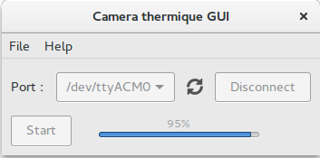

# TRANH201-5

## Screenshots
<p align="center">
  
</p>


## Python dependecies
The script will only work if you have those packages installed :
 - `python3-serial`
 - `python3-matplotlib`
 - `python3-numpy`
 - GTK3+ (PyGObject)
 

## Arduino libraries
To compile the Arduino sketch, you will have to install those libraries :
 - `Adafruit-MLX90614` 


## How to install 

### Python dependecies
  - Windows
    * You can download PyGObject from here http://sourceforge.net/projects/pygobjectwin32/
    * To install PySerial, Matplotlib and Numpy, open CMD as an administrator and write those lines :
    
      * Numpy : `pip3 install numpy`
      
      * Matplotlib : `pip3 install matplotlib` 
      
      * PySerial : `pip3 install pyserial`
     
      Or download those executables files : 
  
        * Numpy : http://sourceforge.net/projects/numpy/files/NumPy/
  
        * Matplotlib : http://sourceforge.net/projects/matplotlib/files/matplotlib/ 
  
        * PySerial does not have an executable file compatible with a newer version of Python (as from Python 3).
  - Debian
  
   `sudo apt-get install python3-matplotlib python3-pyserial python3-numpy`
  
  - Fedora 
  
   `sudo dnf install python3-matplotlib python3-pyserial python3-numpy`
   
   
### Arduino libraries 
  You can install Arduino Librairies using Arduino IDE (available from 1.6.2)
  1. Open Arduino IDE
  2. Click on Sketch -> Include Library -> Manage librairies
  3. Search for `Adafruit-MLX90614` 
  4. Click on install button
  

## How to use ?
### Building a prototype


### Using the GUI
  1. Clone the repository 
    ```bash 
      git clone https://github.com/archaicmuse/TRANH201-5.git
    ```
  2. Open the GUI using
    ```bash
      python3 ui.py
    ```
  Or double click on the file if you're using Windows
### Change the settings

